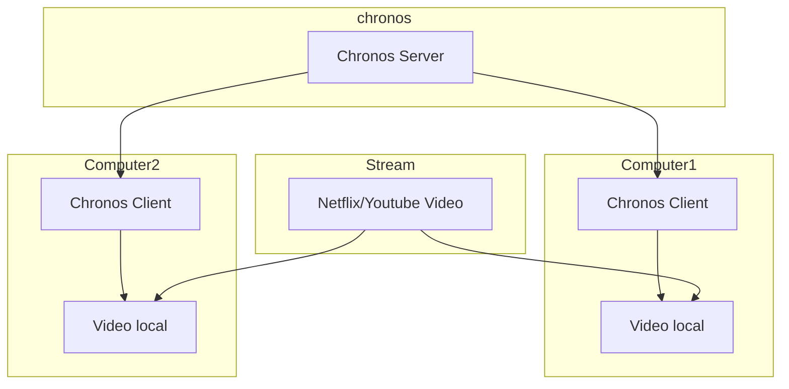

# Architecture
There will be three main components in the chronos application
- chronos server
- multiple chronos clients
- third party video player (such as netflix)

## Chronos Server
The chronos server will handle these main functionalities
- handle room creation
- handle user room joining
- handle user time synchronisation
- handle client events which de-synchronise user video state
  - i.e. if one of the user decides to skip to 3:07, should propagate the changes to all subscribed users i.e. other users within the room
  - this can only be achieved with a full-duplex data streaming capabilities in mind, traditional `http 1.1` methods are in-sufficient. Can explore technologies such as:
    - `http 2`
    - `http 3` (QUIC)
    - `gRPC`

## Chronos Client
The chronos client will be a google chrome extension written with these couple of functionalities in mind:
- the ability to connect to an arbitrary chronos server i.e. able to be connected to any valid self hosted server instance
- UI to join a room
- Settings UI
- behind the scenes
  - when joined a room, will establish a connection with the backend
  - will listen for client events (e.g. skip to timestamp/ play / pause)
  - will listen for server updates (e.g. synchronisation updates from another client)
  - will call functions/plugins which will update the video state

## Integrations
Initially Chronos will only support youtube.
The first couple of planned support will be for these websites in the order:
- Youtube
- Netflix
- Crunchyroll

